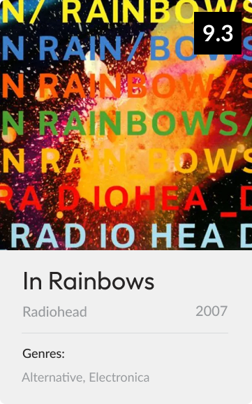

# Objects Album Challenge 🪕

## Requirements

- Create and link a new JavaScript file to the existing index.html file
- Create a new object and add the properties we will need to produce this card (you can use any album you like)
- Using what you know about DOM manipulation, create a function that will render this card to the page
  - It should accept an `albumObject` as a parameter

## Extension

- Create an array of three album objects and using array iterators, render all three to the page at the same time

## Design Spec

[In Rainbows album art](https://media.pitchfork.com/photos/5929b2fe9d034d5c69bf4c59/1:1/w_600/7055fb4d.jpg)

